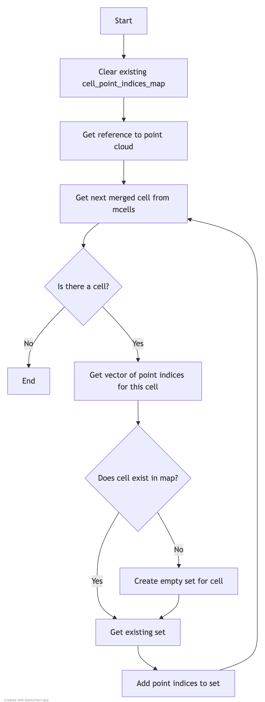

# Understanding form_cell_points_map()

## Purpose
The `form_cell_points_map()` function creates a mapping between SlimMergeGeomCells (merged detector cells) and their associated point indices. This mapping is essential for efficient lookup of points associated with specific detector cells.

## Code Analysis

### Core Function
```cpp
void WCPPID::PR3DCluster::form_cell_points_map() {
    // Clear existing mapping
    cell_point_indices_map.clear();
    
    // Get reference to point cloud
    WCP::WCPointCloud<double>& cloud = point_cloud->get_cloud();
    
    // Iterate through all merged cells
    for (auto it = mcells.begin(); it != mcells.end(); it++) {
        SlimMergeGeomCell *mcell = (*it);
        
        // Get indices of points associated with this cell
        std::vector<int>& wcps = point_cloud->get_mcell_indices(mcell);
        
        // Initialize empty set if needed
        if (cell_point_indices_map.find(mcell) == cell_point_indices_map.end()) {
            std::set<int> point_indices;
            cell_point_indices_map[mcell] = point_indices;
        }
        
        // Add point indices to the set
        for (auto it1 = wcps.begin(); it1 != wcps.end(); it1++) {
            WCPointCloud<double>::WCPoint& wcp = cloud.pts[*it1];
            cell_point_indices_map[mcell].insert(wcp.index);
        }
    }
}
```

## Example Usage

```cpp
// Example of how the mapping works
void example_usage() {
    WCPPID::PR3DCluster cluster(/* params */);
    
    // After form_cell_points_map() is called:
    for (auto& cell_points : cluster.cell_point_indices_map) {
        SlimMergeGeomCell* cell = cell_points.first;
        std::set<int>& points = cell_points.second;
        
        // Now you can access all points for this cell
        for (int point_index : points) {
            // Process point...
        }
    }
}
```

## Data Structure Example

Before mapping:
```
mcells = [Cell1, Cell2, Cell3]
point_cloud = {
    points: [P1, P2, P3, P4, P5, P6],
    mcell_indices: {
        Cell1: [0, 1, 2],
        Cell2: [2, 3, 4],
        Cell3: [4, 5]
    }
}
```

After mapping:
```
cell_point_indices_map = {
    Cell1: {P1.index, P2.index, P3.index},
    Cell2: {P3.index, P4.index, P5.index},
    Cell3: {P5.index, P6.index}
}
```

## Logic Flow Diagram

[form_cell_points_map_logic.md](form_cell_points_map_logic.md)



The diagram illustrates the steps taken by the function to create the mapping between SlimMergeGeomCells and their associated point indices.